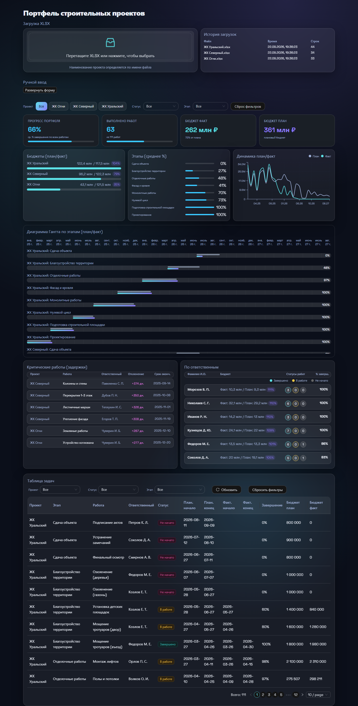
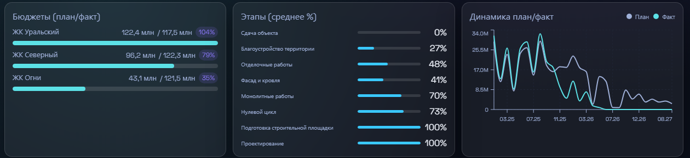
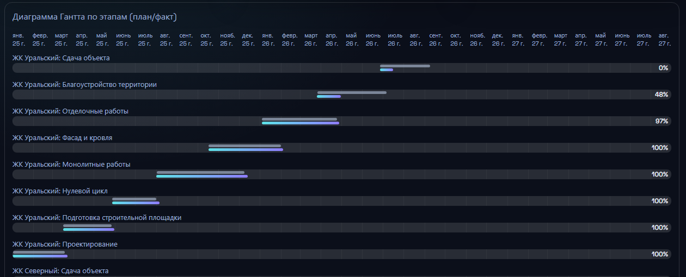
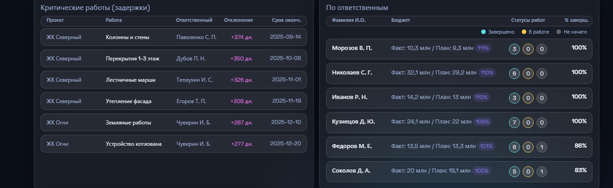
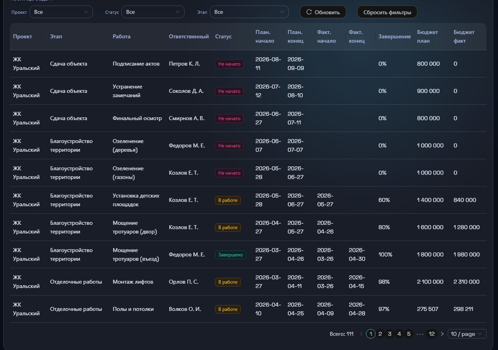
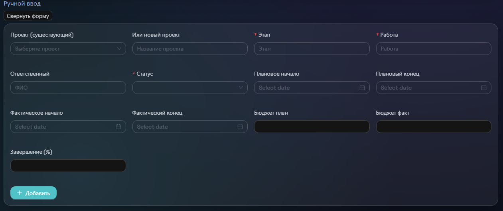

# Дашборд портфеля строительных проектов

Веб-дашборд для контроля портфеля ЖК-проектов: план/факт по срокам и бюджетам, KPI, диаграмма Гантта и таблица с фильтрами. Данные загружаются из обычных Excel-файлов этапов работ.

**Онлайн-демо дашборда по прямой ссылке: https://dilyarakhakim.github.io/construction-projects-dashboard/**

## Скриншот



## Пользователь

Руководитель проектов и аналитик строительной компании, который ведёт портфель из нескольких ЖК и отчитывается по срокам и бюджетам.

## Проблема

Статусы работ по нескольким жилым комплексам ведутся в отдельных Excel-файлах: чтобы ответить «что в портфеле отстаётся от плана и где перерасход бюджета», нужно вручную собирать файлы, сводить их в одну таблицу и пересчитывать показатели. Это повторяющаяся рутина, которую автоматизирует дашборд: файл загружается как есть, а витрина пересчитывается сразу.

## Практическая польза

Дашборд устраняет три типовые проблемы управления портфелем: ручной сбор данных из файлов, отсутствие единой картины по всем ЖК и длительную подготовку отчётности. Ниже — как это работает для конкретных ролей.

> **Конфиденциальность данных.** Дашборд работает полностью автономно: Excel-файл загружается и обрабатывается внутри самого дашборда — локальный backend читает файл, валидирует и раскладывает по собственной базе SQLite. Ни на каком этапе ИИ-сервис не подключается: ни при загрузке и разборе файлов, ни при расчёте показателей, ни при построении графиков и отчётов. Всё разворачивается на локальной машине или внутреннем сервере компании, без облачных хранилищ; даже автономное демо — один HTML-файл, который открывается без сети. Для строительной компании это означает: коммерческая информация (сметы, подрядчики, сроки, персоналии) не покидает контур компании.

### Руководитель проектов

**Проблема.** Статусы по каждому ЖК — в отдельных файлах. Чтобы понять, что просрочено и насколько, нужно открыть каждый файл, отсортировать, вручную посчитать отклонения дат и бюджетов. На подготовку к еженедельному совещанию уходит до двух часов, а данные устаревают к моменту встречи.

**Решение.** Раздел «Критические работы» показывает все задержки портфеля одним списком с отклонением в днях и сроком окончания; диаграмма Гантта — где план и факт разошлись по срокам; срез «По ответственным» — кто держит больше всего незавершённых работ.

**Польза.** Повестка еженедельного совещания готовится за минуты: список задержек сформирован автоматически, показатели рассчитаны. Фактические данные проверяются до совещания, обсуждение сводится к анализу причин отклонений.

### Аналитик

**Проблема.** Ежемесячная пересборка сводного отчёта состоит из ручных операций: консолидация файлов, поиск дубликатов и расхождений в названиях этапов, пересчёт формул. При повторной загрузке файла в сводку легко получить задвоенные строки.

**Решение.** Единый источник — SQLite: импорт идемпотентный (повторная загрузка того же файла не создаёт дубликатов), исходные файлы и история загрузок хранятся в БД, все показатели пересчитываются из данных автоматически.

**Польза.** Время аналитика переносится с подготовки данных на интерпретацию результатов. Данные воспроизводимы: по истории загрузок видно, какой файл и когда дал текущие цифры.

### Руководство и смежные команды

**Проблема.** Сводные отчёты готовятся вручную, к моменту согласования данные устаревают. Графики для презентаций переносятся вручную.

**Решение.** Дашборд всегда показывает текущее состояние портфеля; автономный HTML-файл отправляется одним вложением без установки и сервера; графики витрины выгружаются в презентации (в планах — экспорт в PowerPoint одним нажатием).

**Польза.** Решения принимаются по актуальным данным без ожидания отчёта. Демо и отчёты не требуют доступа к серверу — достаточно открыть файл.

### Ответственный за работы

**Проблема.** Свои работы в общем файле приходится искать вручную; соотношение личной загрузки с бюджетом и общим прогрессом не видно.

**Решение.** Срез «По ответственным» собирает работы человека в один блок: статусы, бюджет план/факт, процент завершения. В таблице — фильтр по проекту и статусу за два клика.

**Польза.** Зона ответственности видна целиком, без поиска по таблицам других сотрудников: число работ в каждом статусе и освоение бюджета по конкретному человеку.

## Основная функция

- **Вход:** XLSX-файл этапов работ по одному ЖК (11 колонок: этап, работа, ответственный, статус, плановые/фактические даты, завершение, бюджет план/факт). Имя файла = имя проекта. Возможен и ручной ввод отдельной работы.
- **Обработка:** файл валидируется по строгой структуре, импортируется в SQLite идемпотентно (повторная загрузка не создаёт дубликатов), исходный файл сохраняется в БД.
- **Выход:** интерактивная витрина — KPI, графики по проектам и месяцам, диаграмма Гантта этапов, таблица работ с фильтрами.

## Блоки дашборда

### KPI-карточки портфеля

Прогресс завершения, выполнено работ, бюджет факт и план — сводка по всему портфелю на одном экране.

**Практическая польза.** Состояние портфеля оценивается по сводным показателям без открытия файлов и ручного подсчёта сумм и процентов — эти цифры раньше собирались отдельной строкой сводной таблицы.


### Бюджеты по проектам

План/факт бюджета по каждому ЖК с процентом освоения.

**Практическая польза.** Перерасход и недоосвоение видны без сведения смет из нескольких файлов и ручного расчёта процентов. Освоение выше 100% — основание для проверки расходования бюджета; ниже 40% при активной стройке — индикатор отставания работ.



### Этапы и динамика план/факт

Средний процент завершения по этапам и помесячная динамика планового/фактического освоения бюджета.

**Практическая польза.** Этап с низким процентом завершения при большом бюджете — системное ограничение, которое легко пропустить в построчных таблицах. Динамика по месяцам показывает тренд: темп работ растёт или замедляется — раньше для такого сравнения требовалось вручную сопоставлять сводки за два месяца.

### Диаграмма Гантта по этапам

План и факт по срокам для каждого этапа каждого ЖК: серая полоса — плановый период, цветная — фактическое выполнение.

**Практическая польза.** Наложение плана на факт по срокам раньше делалось вручную в Excel — теперь расхождение видно сразу: опережения, затяжные этапы, работы, идущие за пределами планового периода. 33 месяца портфеля на одном экране.



### Критические работы и ответственные

Топ задержек с отклонением в днях и срез по ответственным: статусы работ, бюджет, процент завершения.

**Практическая польза.** Список задержек для совещания формируется автоматически — раньше собирался вручную сортировкой и фильтрами по каждому файлу. Персональный срез даёт предметную основу для обсуждения: число работ в каждом статусе и освоение бюджета по конкретному ответственному.



### Таблица работ с фильтрами

Все работы портфеля с датами, завершением и бюджетами; фильтры по проекту, статусу и этапу.

**Практическая польза.** Точечные вопросы («незавершённые работы ЖК Северный с бюджетом больше миллиона») решаются двумя кликами вместо сводного файла с формулами. Подписи фильтров и сброс одной кнопкой — выборка собирается быстрее, чем в Excel.



### Загрузка XLSX и ручной ввод

Файл перетаскивается в зону загрузки — проект создаётся из имени файла; отдельная работа добавляется формой.

**Практическая польза.** Подготовка сводной витрины сводится к загрузке файла и занимает минуты, без адаптации файла под шаблон. Ручной ввод применяется, когда отдельная работа появилась, а файл этапов ещё не готов.




## Что происходит при загрузке Excel-файла

Загрузка — ключевой сценарий, поэтому она устроена строго и предсказуемо:

1. **Проект из имени файла.** Файл «ЖК Уральский.xlsx» создаёт или пополняет проект «ЖК Уральский» — ручное сопоставление файлов и проектов не требуется.
2. **Валидация структуры.** Файл проверяется на жёсткую структуру из 11 колонок (этап, работа, ответственный, статус, плановые/фактические даты, завершение, бюджет план/факт). При ошибке — понятное сообщение с указанием ожидаемых колонок, а не «не удалось загрузить».
3. **Идемпотентный импорт.** Файл раскладывается в SQLite построчно; повторная загрузка того же файла не создаёт дубликатов — запись обновляется по ключу (проект, имя файла, хеш содержимого). Повторная загрузка безопасна для данных.
4. **Исходник сохраняется.** Содержимое файла хранится в БД вместе с хешем — исходные данные всегда восстановимы.
5. **История загрузок.** Каждая загрузка фиксируется в БД: файл, время, число строк (см. скриншот выше). По истории видно, какой файл и когда обновлял данные; в Excel-сводках происхождение цифр восстанавливается вручную.

После загрузки все показатели — KPI, графики, диаграмма Гантта, таблица — пересчитываются автоматически, отдельное обновление сводки не требуется.

## Формат результата

Работающий дашборд в браузере: `http://localhost:3001`. Всё работает локально: backend и база данных — на машине пользователя, данные не покидают компьютер (см. «Конфиденциальность данных» выше). Отдельно собирается автономный `demo/dashboard_offline.html` — тот же дашборд одним HTML-файлом, работающий без сервера; файл хранится прямо в репозитории, поэтому демо можно скачать и открыть без установки (для отправки руководителю или коллеге).

## Минимальный функционал (MVP)

Реализовано:
- Импорт XLSX с валидацией структуры и понятными сообщениями об ошибках
- Идемпотентный upsert-импорт в SQLite (projects / files / records / imports_log)
- KPI-карточки, графики, диаграмма Гантта этапов, таблица с фильтрами
- Ручное добавление работ через форму
- Автономное оффлайн-демо одним HTML-файлом

В планах:

**Сравнение периодов (метрики MoM, month-over-month).** Планируется добавить динамику показателей относительно предыдущего месяца:

- дельты на KPI-карточках: «среднее завершение 66%, +5 п.п. к прошлому месяцу» со стрелками ↑/↓ — темп работ виден сразу, без чтения графиков;
- линия тренда завершения портфеля по месяцам: темп работ растёт или замедляется;
- контроль темпа освоения бюджета: факт месяца против плана и против прошлого месяца — расход растёт быстрее работ или отстаёт;
- счётчик новых просрочек: сколько работ ушло в задержки за месяц и сколько вернулось в график.

**Экспорт графиков витрины в PowerPoint.** Дашборд остаётся инструментом анализа, но его результаты попадают в формат отчётных презентаций без ручного переноса цифр: графики выгружаются как изображения и вставляются в слайды ежемесячного отчёта по портфелю. Технически — роут экспорта в backend (графики Recharts рендерятся в PNG) и кнопка «Экспорт» в UI.

**Роли и права доступа для команды.** Разделение «руководитель проекта / аналитик / наблюдатель»: кто-то загружает данные и правит работы, кто-то только смотрит витрину.

## Технологии

- **Backend:** Node.js, Express, better-sqlite3, multer, SheetJS (xlsx)
- **Frontend:** React 18 (Vite), Ant Design 5, Recharts, dayjs
- **БД:** SQLite со схемой projects / files / records / imports_log + view `records_with_project`
- **Инструменты:** Claude Code (разработка), GitHub CLI (публикация), Python + openpyxl (CLI-импортёр для сидирования БД)

## Запуск

Онлайн, без установки: [открыть демо дашборда](https://dilyarakhakim.github.io/construction-projects-dashboard/) — тот же дашборд с данными трёх ЖК, работает в браузере. Файл `demo/dashboard_offline.html` также можно скачать из репозитория и открыть локально.

Полная версия с базой данных: требуется Node.js >= 20 и Python 3 (с `openpyxl`) для сидирования БД.

```bash
npm run setup      # установка зависимостей backend + frontend
npm run seed       # сборка БД из data/*.xlsx
npm run build      # сборка фронтенда
npm start          # запуск: http://localhost:3001
```

Для разработки: `npm run dev` (API на 3001, Vite на 5173).
Автономное демо без сервера: `npm run export:offline` → `demo/dashboard_offline.html`.

## Пользовательский сценарий

1. Откройте `http://localhost:3001` — на главной KPI-карточки портфеля.
2. В секции «Загрузка» перетащите XLSX этапов работ — проект создастся из имени файла, данные появятся на витрине.
3. Или добавьте работу вручную через форму (файл не нужен).
4. Смотрите графики: завершение по проектам, бюджеты план/факт, план/факт по месяцам; сроки — на диаграмме Гантта.
5. В таблице фильтруйте работы по проекту, статусу и этапу.

## Структура репозитория

```
backend/          Express API (server.js) + package.json
frontend/         React SPA (src/, vite.config.js), dist/ — gitignored сборка
data/             исходные XLSX-файлы (в git)
db/               SQLite, gitignored — собирается командой npm run seed
demo/             dashboard_offline.html — автономное демо (в git), пересобирается npm run export:offline
scripts/          seed_db.py (импортёр), build_offline.js (автономное демо)
screenshots/      скриншоты для README
.claude/skills/   скилл для работы с репозиторием через Claude Code
CLAUDE.md         контекст проекта для Claude Code
```

БД и сборка фронтенда в git не хранятся — воспроизводятся из исходников командами `npm run seed` и `npm run build`. Автономное демо `demo/dashboard_offline.html` в git хранится сознательно: его можно скачать из репозитория и открыть двойным кликом — работающий дашборд без установки Node и Python.

---

Проект разработан через Claude Code. Скилл в `.claude/skills/construction-dashboard/SKILL.md` позволяет развернуть и дорабатывать проект в новом окружении.